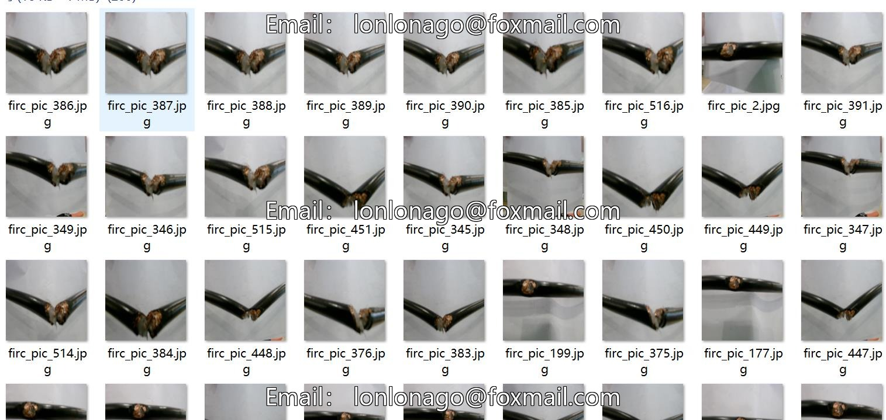
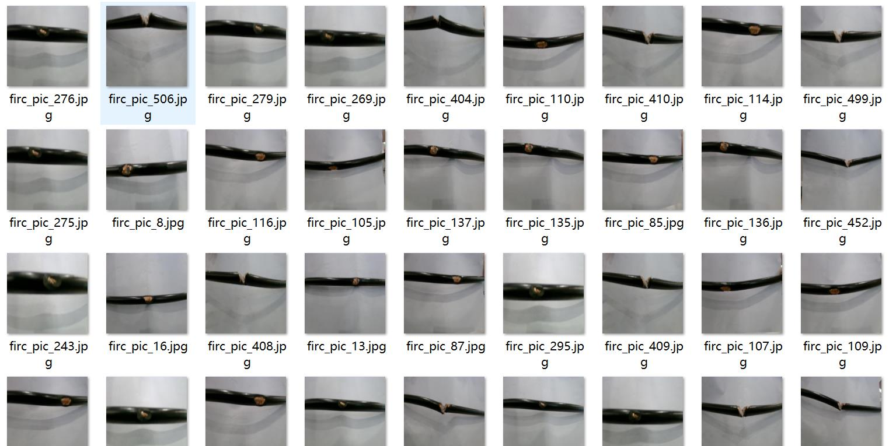
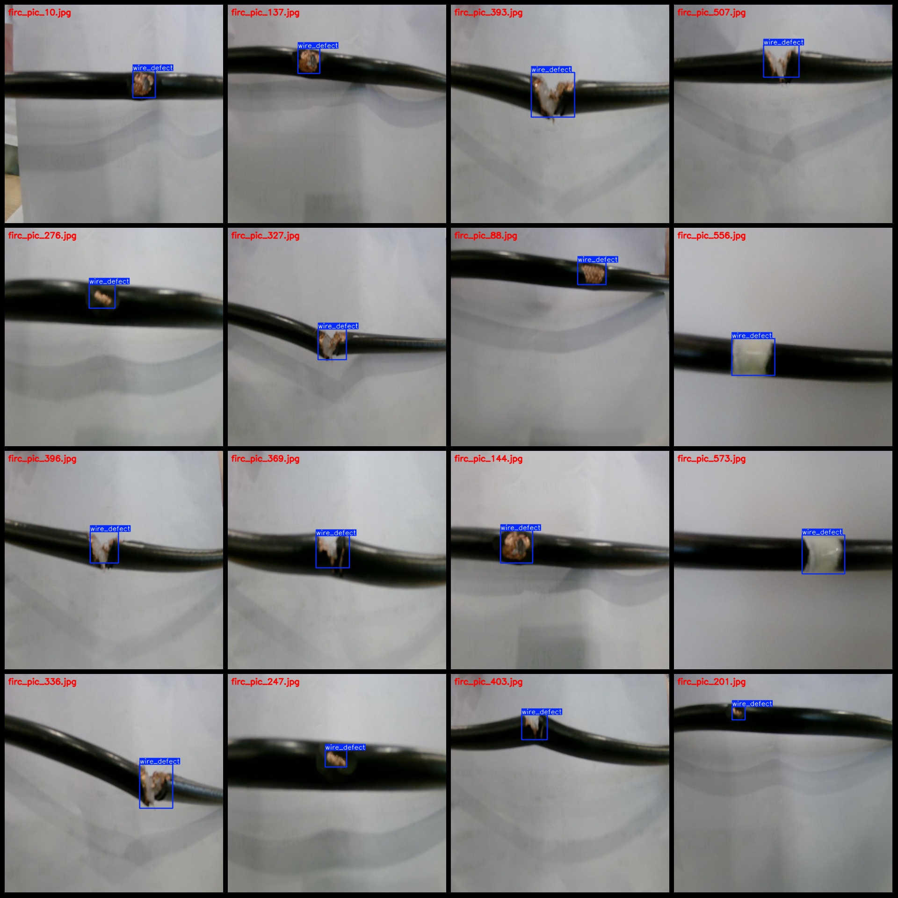
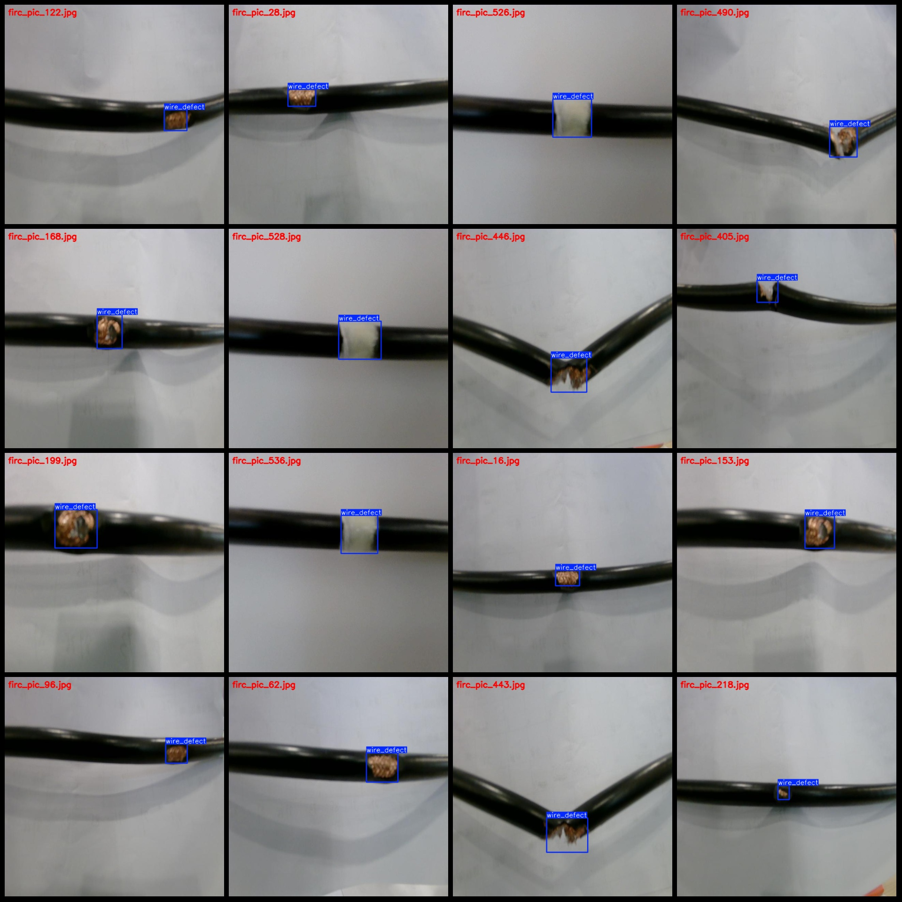

# Cable Defect Detection Dataset VOC+YOLO Format with 608 Images in 1 Category

Note: The dataset contains images taken from three different defect locations at different angles. To see the specific images, please refer to the images.

Dataset format: Pascal VOC format + YOLO format (excluding the split path's txt file, only containing jpg images along with corresponding VOC format xml files and yolo format txt files)

Number of images (number of jpg files): 608
Number of annotations (xml file count): 608
Number of annotations (txt file count): 608
Number of annotation categories: 1
Annotation category name: ["wire_defect"]
Number of bounding box per category:
- wire_defect bounding boxes = 609
Total bounding boxes: 609
Number of images each category occupies:
- wire_defect occupies images = 608
Image resolution: 640x640
Annotation tool used: labelImg
Annotation rules: Draw bounding boxes for classes
Important note: The dataset does not have a training/validation/test split; you need to manually divide it.
Special declaration: This dataset does not guarantee the accuracy of the trained models or weight files.
Image previews:
Annotation examples:

## Images

Here is a pay link on Stripe ( https://buy.stripe.com/3cs8yP7sY87d0vu9AB ). Please contact me lonlonago@foxmail.com after funding $89, and I will send you a complete data files , thank you!

